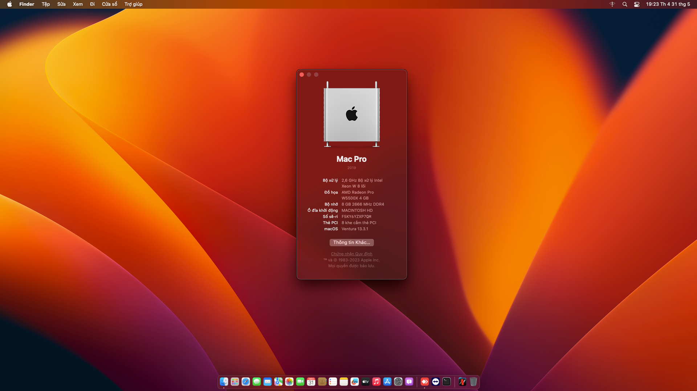

# 
Asus H510M-K RX560 Hackintosh
 

## Intro

| | Version |
|-|---------|
| OpenCore | 0.9.2 |
| macOS | Sonoma 14.0 |

## Desktop Specification

|                     | Specifications| Note |
| ---------------------------- | ---------------------- |------------------|
| ``Chipset``| Intel Tiger Point |   |
| ``CPU``| Intel Core i5-11400 2.60GHz |  |
| ``Memory``| 8GB DDR4-2666MHz |  |
| ``iGPU``| Intel UHD Graphics 730 | Not Supported in Hackintosh. |
| ``dGPU``| AMD Radeon RX 560 4 GB | Native in macOS |
| ``Disk``| KINGSTON SA400S37120G |  |
| ``Screen``| 23.4" 1920 x 1080 |    |
| ``Ethernet``| Intel Ethernet Connection (14) I219-V | Use [IntelMausi](https://github.com/acidanthera/IntelMausi). |
| ``Audio``| Realtek ALC897 |(Not work at this time) Only works with HDMI Audio Output. |
| ``Keyboard``| - |  |

## Features

| ``Features``|``Working``| 
|-------------|-----------|
| ``Audio``|⚠️|
| ``Keyboard``|✅|
| ``Headphone Jack``|❌|
| ``Graphics``|✅|
| ``Power Management``|✅|                                                                        
| ``USB Port``|✅|
| ``Facetime and iMessage``|✅|
| ``Ethernet``|✅|
| ``Sleep``|✅|
